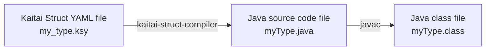

# Kaitai Struct: visualization GUI tool in Java

This is a Java-based GUI for data structure visualizations in binary
formats, based on [Kaitai Struct](http://kaitai.io) project. This vis
tool uses [Java's Swing](https://en.wikipedia.org/wiki/Swing_%28Java%29)
for its GUI elements.


Its functionality is akin to similar projects:

* [kaitai_struct_visualizer](https://github.com/kaitai-io/kaitai_struct_visualizer) in Ruby
* [WebIDE](https://ide.kaitai.io/) in TypeScript for web brosers
* [kaitai-struct-vscode](https://marketplace.visualstudio.com/items?itemName=fudgepops.kaitai-struct-vscode) in
  TypeScript for [VS Code](https://code.visualstudio.com/)

... but this Java version is significantly simpler and is no longer under
active development.

Kaitai Struct is a declarative language used to describe various
binary data structures, laid out in files or in memory: i.e. binary
file formats, network stream packet formats, etc.

The main idea is that a particular format is described in Kaitai
Struct language (`.ksy` files) only once and then can be compiled with
this compiler into source files in one of the supported programming
languages. These modules will include the generated code for a parser
that can read described data structure from a file / stream and give
access to it in a nice, easy-to-comprehend API.

## Build

Install Java (JDK 8 or newer) and Apache Maven. If on Windows, also install Git.

Download or clone this repository. Run this command:

```bash
mvn install
```

then the output will be in a subdirectory called `target`.

## Compilation steps

When a ksy file is selected in the gui, two things happen:


<!-- https://mermaid-js.github.io/mermaid/#/flowchart -->



## Standalone usage

Depending on the system, double-clicking on the jar file may launch the GUI.

Otherwise, launch the GUI via the command-line. The exact name of the jar file will vary. The form is:

```bash
java -jar kaitai_struct_visualizer_java.jar
```

The input files can be specified as arguments, in this order:

```bash
java -jar kaitai_struct_visualizer_java.jar binaryFileToParse ksyFile
```

## Usage as a library

The visualizer can be used on its own, without automatic compilation of KSY files.

If you have a KSY file that doesn't change, you can pre-compile it to Java source code
and add it to your project's sources.

Here is sample code:

```java
VisualizerPanel visualizerPanel = new VisualizerPanel(null);
visualizerPanel.setKaitaiStructClass(MyKaitaiStruct.class);
visualizerPanel.setBinaryStreamToParse(new ByteBufferKaitaiStream(filename));
visualizerPanel.parseFileAndUpdateGui();
```

If you want, you could even load a compiled .class file from disk at runtime:

```java
// https://stackoverflow.com/a/6219855
// Must give the directory containing the class file, and it must end in a slash for the class loader to treat it as a directory!
String dirName =
        "C:/Users/lumenetix/OneDrive - ERP Power LLC/Documents/kaitai struct stuff/KaitaiStructSerializationTest/build/classes/";
String fullyQualifiedClassNameToLoad = "Lux";
URL[] urlsToSearch = new URL[]{new File(dirName).toURI().toURL()};
try (URLClassLoader classLoader = new URLClassLoader(urlsToSearch)) {
    Class<?> theClass = classLoader.loadClass(fullyQualifiedClassNameToLoad);
    Class<? extends KaitaiStruct> cast = (Class<? extends KaitaiStruct>) theClass;
    visualizerPanel.setKaitaiStructClass(cast);
}
```

## Licensing

This GUI vis tool project itself is copyright (C) 2016-2022 Kaitai
Project.

This program is free software: you can redistribute it and/or modify
it under the terms of the GNU General Public License as published by
the Free Software Foundation, either version 3 of the License, or (at
your option) any later version.

This program is distributed in the hope that it will be useful, but
WITHOUT ANY WARRANTY; without even the implied warranty of
MERCHANTABILITY or FITNESS FOR A PARTICULAR PURPOSE. See the GNU
General Public License for more details.

You should have received a copy of the GNU General Public License
along with this program. If not, see <http://www.gnu.org/licenses/>.

### Libraries used

Vis tool depends on the following libraries:

* [kaitai_struct_compiler](https://github.com/kaitai_struct_compiler) — GPLv3+ license
    * [fastparse](http://www.lihaoyi.com/fastparse/) — MIT license
    * [snakeyaml](https://bitbucket.org/asomov/snakeyaml) — Apache 2.0 license
* [JHexView](https://github.com/Mingun/JHexView) — LGPL-2.1 license
